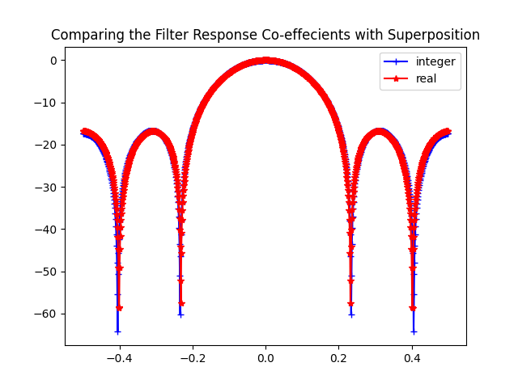
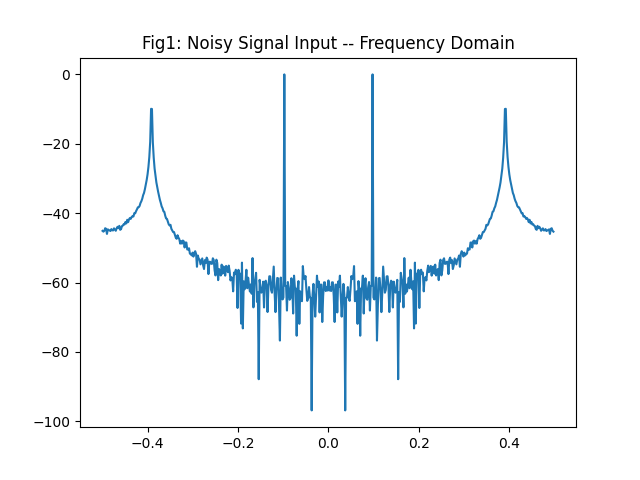
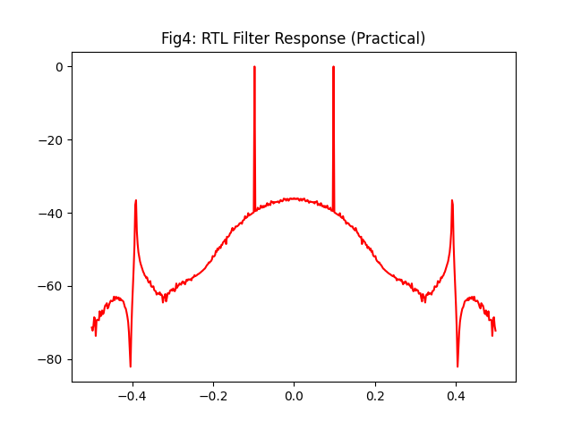
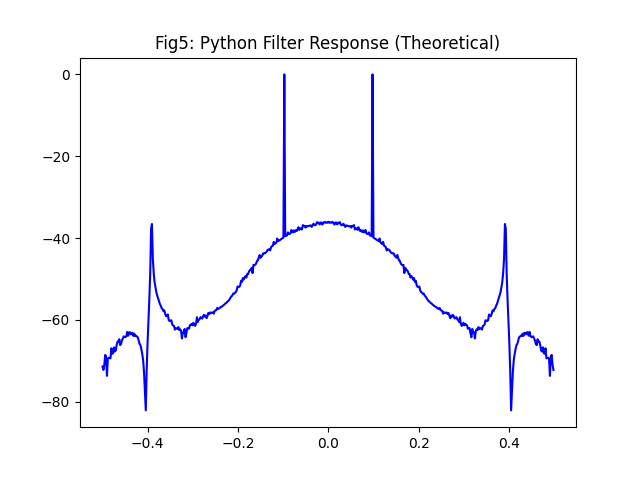
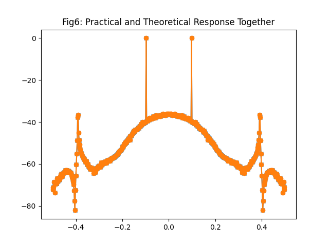

# FIR-Filter-Design-in-SystemVerilog
A generic 7 tap FIR filter implementation in System Verilog, and verified with Cocotb. 

The file `fir_filter.py` extracts the co-efficients needed for a 7 tap FIR filter, and converts it into integer values which can be easily used in hardware implementation. 

As the following figure shows, the rounding off of the real co-effecients does not deviate the frequency spectrum by much.

The hardware implementation is of the form of a Transpose FIR filter, referred from this blog: 
(https://www.allaboutcircuits.com/technical-articles/pipelined-direct-form-fir-versus-the-transposed-structure/)

We generate a low frequency signal with an arbitrary high frequency signal to create a noisy signal. 

As we can see, the practical filter (implemented on SystemVerilog) 
 

is nearly same as the theoretical one implemented in Python. 

In fact, if we superimpose them on one another, we can see that the output from both the cases is nearly identical. 

## Project status

- [x] Co-effecient Extraction Python Code
- [x] Dflop Design and Verification
- [x] FIR Filter SV Design
- [x] Cocotb Verification
- [x] Complete Documentation
- [] Possible optimizations to think of and try

References: 
1. https://www.allaboutcircuits.com/technical-articles/pipelined-direct-form-fir-versus-the-transposed-structure/
2. https://www.youtube.com/watch?v=uNNNj9AZisM&t=925s&pp=ygUKRklSIEZpbHRlcg%3D%3D
3. https://www.youtube.com/watch?v=SEhcFTuTQB8&t=302s&pp=ygUKRklSIEZpbHRlcg%3D%3D
4. https://hardwareteams.com/docs/fpga-asic/cocotb/fir-filter/
5. https://circuitcove.com/design-examples-fir-filter/

